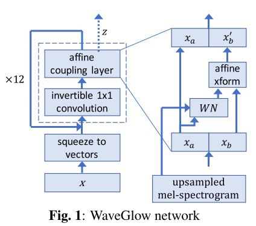

# WaveGlow
A Tensorflow implementation of the WaveGlow: A Flow-based Generative Network for Speech Synthesis(
https://arxiv.org/abs/1811.00002)



## Preparing data

1. Set parameters in hparam.py
2. `python process.py --wav_dir='wavs' --output='data'`

## Training

`train.py` is the entry point:

```
$ python train.py--wave_dir="data/train/audio" --lc_dir="data/train/mel"
```

Trained models are saved under the `logdir/waveglow` directory.

## Generating

`generate.py` is the entry point:

```
$ python generate.py --lc_dir="data/test/mel" --out_dir="samples" --restore_from="logdir/waveglow"
```

## Notes
* baseline model is trained using data form here(https://weixinxcxdb.oss-cn-beijing.aliyuncs.com/gwYinPinKu/BZNSYP.rar)
